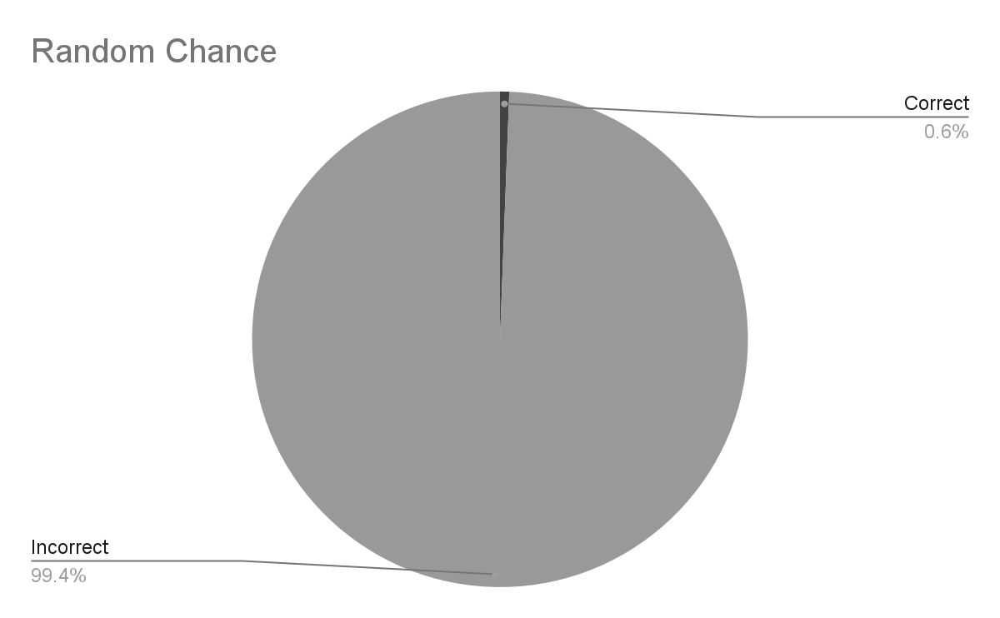
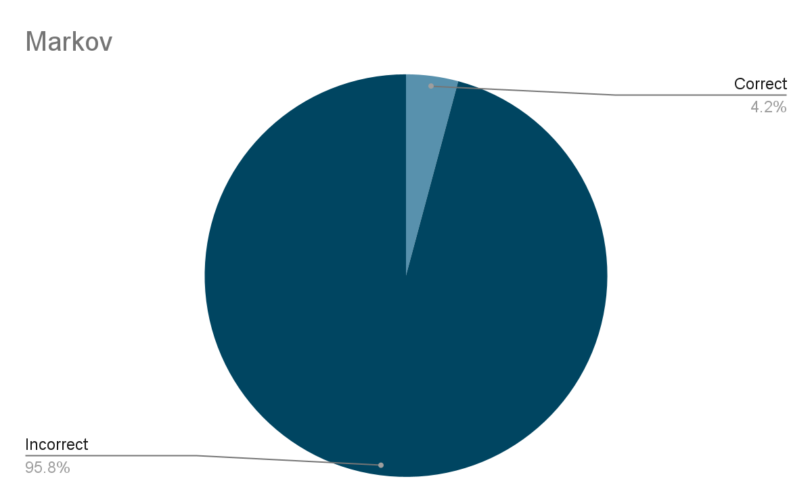
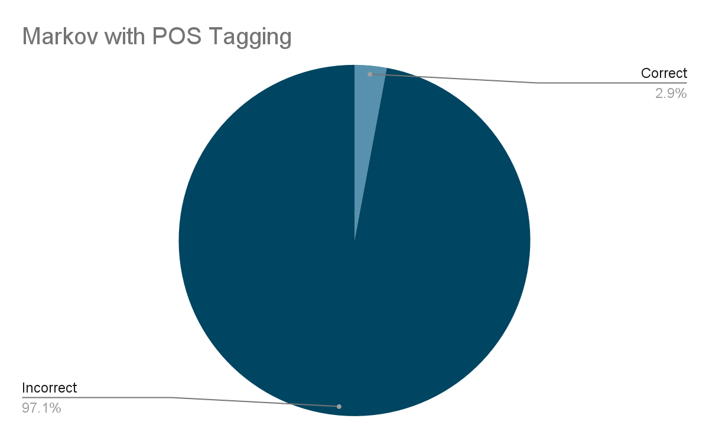
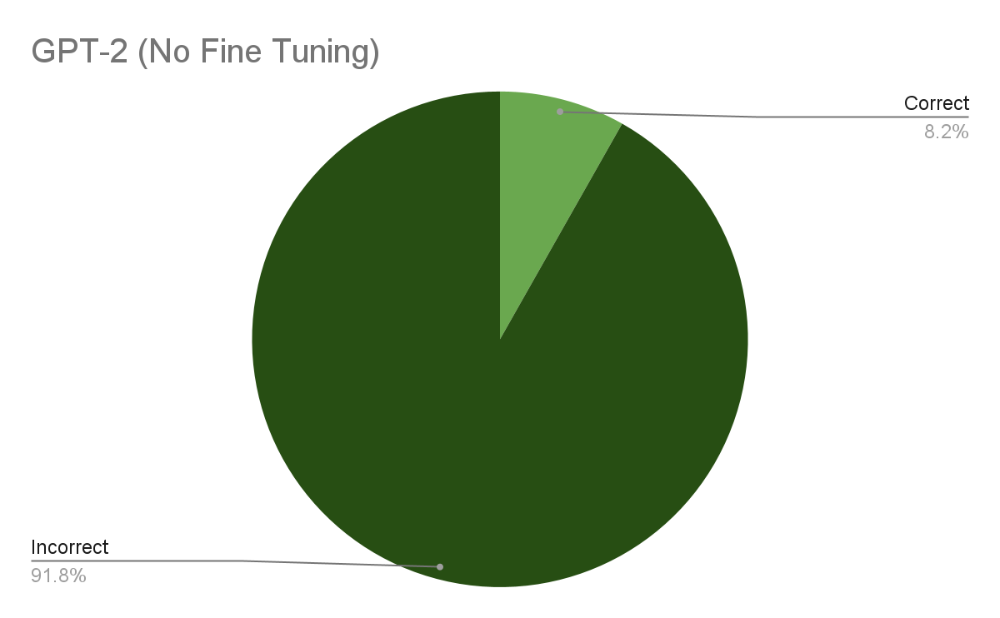
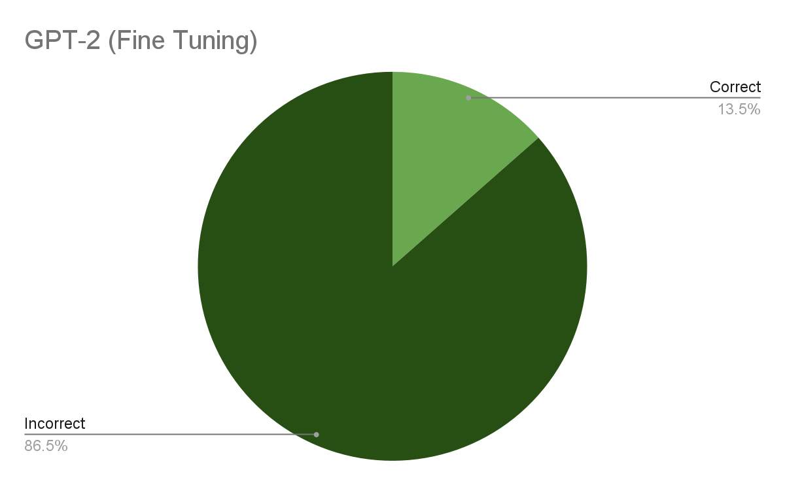
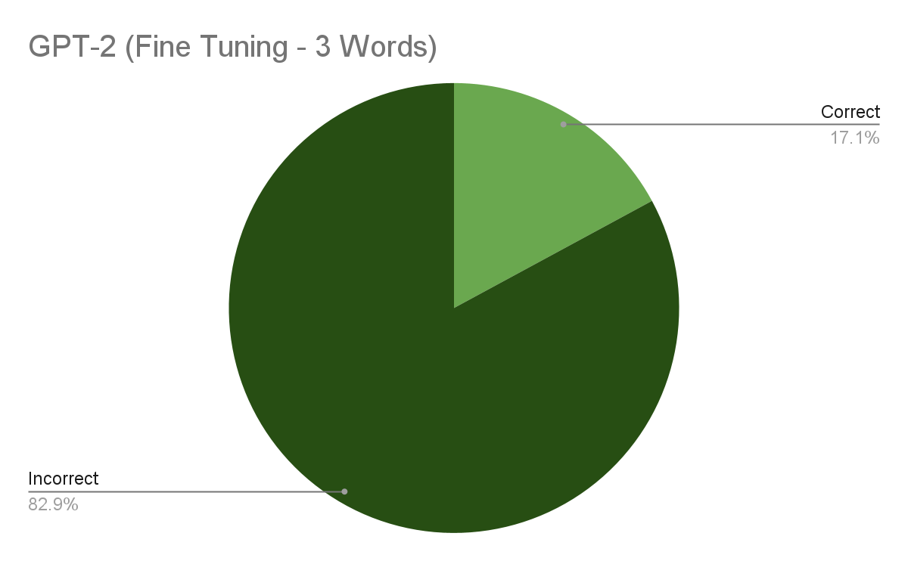
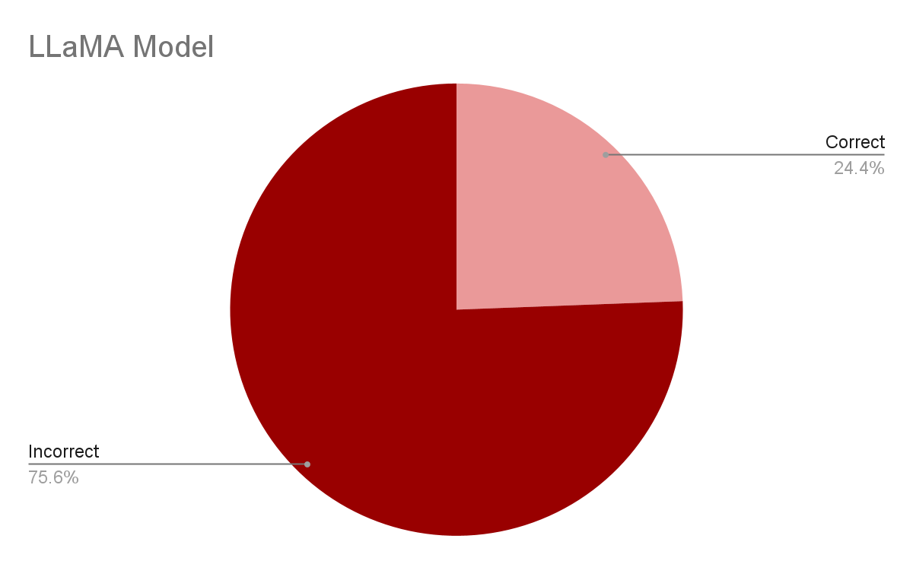

# Introduction

The main focus of our project was taking the large dataset we could get from Discord to see if we could create personalized language models. Originally, the goal was to create something like chatgpt, that would produce full text messages. However, we quickly realized that we did not have the resources to train a model of that size. Instead, we decided to focus on creating a model that would generate the next word in a sentence.

We used three different models to generate text: Markov Chains, GPT-2, and LLaMA. We used a random selection model as a baseline and then used Markov Chains, GPT-2 and LLaMA to see if we could improve on the baseline. We also used GPT-2 to generate full text messages.

# Demo

On the local version of our webpage, you can type in a sentence and receive a prediction for the next word. You can also select whose model you want to use. The models are trained on the following users:

- Chris - Markov Chains
- Molly - GPT-2
- Daniel - LLaMA

# Results

To evaluate our models, we took each message in the test set and let the model predict each word in the message. We then calculated the accuracy of the model by seeing how many times the model predicted the correct word.

If we had more time, we would have liked to have a more robust evaluation. Including

- Perplexity: Taking the inverse of the probability of a word. This would give us a better idea of how confident the model is in its prediction.
- Word2Vec: We would have liked to see how similar the predicted word was to the actual word.

## Baseline - Random Selection

Random selection gave an accuracy of just 0.6%. This demonstrates just how difficult the problem is, which gives a better perspective on the other models results.



## Chris - Markov Chains

Markov chains got an accuracy of 4.2%. This is a significant improvement over random selection, but still not very good. This is likely because the model is only looking at the previous word, which is not enough context to make a good prediction. There is also the issue that the model can only predict words that have been seen before, which also limits the accuracy.

We also ran a test with POS tagging, which is where we tag each word with its part of speech. This gave an accuracy of 2.9%, which is slightly worse than the untagged version. This is likely because the POS tags are not very accurate, which makes it harder for the model to predict the next word.





## Molly - GPT-2

We used the 117M parameter GPT-2 model to generate text. Our results show a marked improvement over markov chains. They also show that both fine-tuning and generating more than one word at a time improve the accuracy of the model. At the peak of our results, we were able to get an accuracy of 17.1%. This is a significant improvement, likely because the model is able to look at more context than the markov chain model. 








Since it was simple to extend the GPT-2 model to generate more than one word, we decided to run a test to see what kind of text it would generate. Below is some example text generated by the fine-tuned GPT-2 model. In general, while the words are completely incoherent, the actual speach patterns were replicated really well. The model picked up on the use of swear words and the rather shortened speech patterns of the user.

(Note: the output has been edited to censor swear words)
```
how are you doing? Im not sure if you're doing it for the money or not but i'm not really sure what you mean by that.
i'm just trying to figure out what to do with my time
im not a big fan of the whole "you're not allowed to be a part of this ****" thing
you know what i mean
it's not like i don't like the way you guys are doing things
its just that i dont like how you are so much more of a ****
well im not
but i do like your style of music
and i like that you have a lot of friends
so i guess i'll just have to wait for you to get back
ok
just a few minutes
goodnight
yall
haha
yeah
lol
this is the first time i've ever seen you
oh
no
that's a good thing im just so happy
like
if you want to read more about me i would love to hear from you on twitter
or
hey
what are your thoughts on the new album
the first track is called "The Last Time"
they are both about the time you were born
my mom is a huge fan
she is also a fanboy
he is
not sure how much of that is true
how do you feel about it
is that a problem
anyway
we are all so **** excited about this album so i hope you like it so far
all the songs are about you and your life
every single one of them is about your mom
your mom was a great mom and you just want her to know that
her mom always wanted to make sure you had a happy life and that was the only thing that mattered
when you got to college you went to a really ****ty school
a really crappy school that had no chemistry
there was no music class
everyone was just doing their thing and doing nothing
even though you did
because you didn't want them to
which is why you don
really
wtf is wrong with you?
why do i have this problem with your music? i just don. i know you know how it feels to have your entire life under your control
****
do you really want me to tell you how to feel like a **** idiot
let me just say that right now
****
****
ah
god
holy ****
nah
shh
nope
thats the thing i was thinking
btw
did you do that
```

## Daniel - LLaMA

We used the 7B version of LLaMA to generate text. Due to limited computing resources, we were only able to test the fine-tuned model. We were able to get an accuracy of 24.4%. This is a significant improvement over the other models which can be attribute to the fact it is a much larger model



# Links

[Github](https://github.com/danilka4/chairdelure)

[Presentation](https://docs.google.com/presentation/d/15svjXQ1-7BFERnNyG62YWnHa_xMhKhmvUEAuMoVDrcw/edit?usp=sharing)

[Paper](https://google.com)